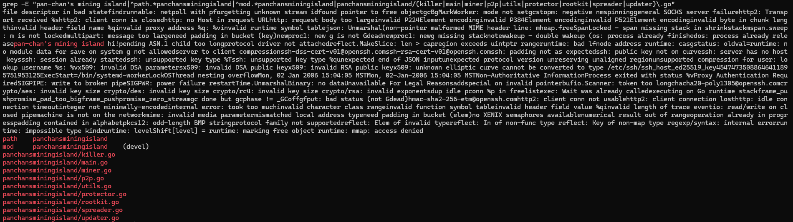

# Recurring PANCHAN Activity

After first capturing PANCHAN malware on September 17, 2026, I continued to see similar activity on the honeypot from different source IP addresses.

The sessions shared several characteristics with the original attack, including the same SSH client fingerprint, root login attempts, SFTP transfers, and files uploaded under the name `sshd`.

My original analysis of the malware can be found in [panchan.md](panchan.md).

## Recurring Activity

| Date | Source IP | Credentials | HASSH | Uploaded File | SHA-256 |
|---|---|---|---|---|---|
| Sep 17 | 146.59.99.179 | root/ubuntu | `98ddc560...` | sshd | `94f2e4d8...` |
| Sep 22 | 101.47.134.74 | root/ubuntu | `98ddc560...` | sshd | `94f2e4d8...` |
| Sep 25 | 36.163.118.108 | root/centos | `98ddc560...` | sshd | `c6f5414f...` |
| Sep 26 | 115.190.53.236 | root/debian | `98ddc560...` | sshd | `169e1952...` |
| Sep 26 | 59.37.94.126 | root/ubuntu | `98ddc560...` | sshd | `37f75998...` |
| Sep 26 | 175.6.146.164 | root/ubuntu | `98ddc560...` | sshd | `bcb1b19a...` |
| Sep 29 | 175.100.126.149 | root/ubuntu | `98ddc560...` | sshd | `8e730cdd...` |

## September 29 Capture

On September 29, a connection from `175.100.126.149` successfully logged in using `root/ubuntu`.

The SSH client identified itself as:

`SSH-2.0-Go`

The session also had the HASSH fingerprint:

`98ddc5604ef6a1006a2b49a58759fbe6`

After authentication, an `sshd` file was transferred to the honeypot through SFTP. The session lasted about five minutes.

The captured file had the SHA-256:

`8e730cdde5708b2704ac0c67d78b36fd2fcf62d195a1c056f6ee87ca655d5187`

## Static Analysis

The captured file was a 64-bit x86-64 ELF executable and was 29,655,040 bytes.

Running `strings` against the file revealed several references directly associated with PANCHAN:

```text
pan-chan's mining island hi!
path    panchansminingisland
mod     panchansminingisland    (devel)
panchansminingisland/killer.go
panchansminingisland/main.go
panchansminingisland/miner.go
panchansminingisland/p2p.go
panchansminingisland/utils.go
panchansminingisland/protector.go
panchansminingisland/rootkit.go
panchansminingisland/spreader.go
panchansminingisland/updater.go
'''


