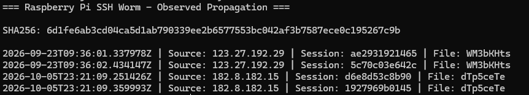

# Raspberry Pi SSH Worm Analysis

## Overview

The Cowrie honeypot captured a Bash-based SSH worm targeting systems using common Raspberry Pi credentials.

The same payload was observed from two different source IPs on September 23 and October 5, 2026. Both sources transferred an identical script with the following SHA-256 hash:

`6d1fe6ab3cd04ca5d1ab790339ee2b6577553bc042af3b7587ece0c195267c9b`

## Observed Activity

The honeypot recorded attempts using the `pi` account with passwords including:

- `raspberry`
- `raspberryraspberry993311`

After authentication, the attacker used SCP to transfer the script into `/tmp` and attempted to make it executable and run it.

The uploaded filename changed between sources, but the SHA-256 hash remained identical.

## Payload Analysis

Static analysis showed that the Bash script was designed to:

- Establish persistence using `/etc/rc.local`
- Modify the `pi` account password
- Add an SSH public key to the root account
- Kill processes associated with miners and other malware
- Connect to IRC servers on port 6667
- Receive and execute signed commands through IRC
- Install `zmap` and `sshpass`
- Scan for systems with SSH exposed
- Attempt authentication using Raspberry Pi credentials
- Copy itself to successful targets using SCP

The script scans large groups of IP addresses for TCP port 22 and attempts to propagate itself to systems accepting the targeted credentials.

## Assessment

This capture demonstrates automated SSH worm behavior rather than simple credential scanning.

The most interesting part of the observation was seeing the same payload delivered from separate source IPs nearly two weeks apart. This is consistent with an ongoing automated propagation campaign.

All analysis was performed statically on files captured by Cowrie. The payload was never executed on the underlying EC2 system.
