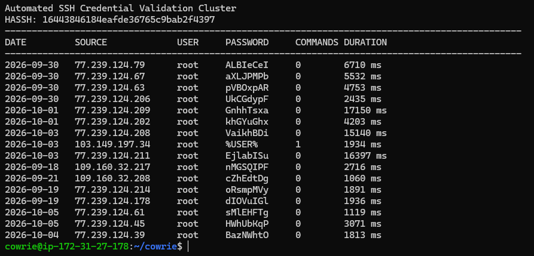

cat > /tmp/ssh-credential-validation.md <<'EOF'
# SSH Credential Validation Activity

A recurring SSH pattern was observed in the honeypot involving successful root authentications followed by little or no post-login activity.

The connections shared the HASSH fingerprint:

`16443846184eafde36765c9bab2f4397`

The client identified itself as `SSH-2.0-Go`, and all observed connections using this fingerprint shared the same SSH algorithm set.

## Observed Activity

Between September 18 and October 5, the honeypot recorded 15 successful root authentications using unique, random-looking passwords associated with this pattern.

Examples included:

- `oRsmpMVy`
- `ALBIeCeI`
- `pVBOxpAR`
- `GnhhTsxa`
- `VaikhBDi`
- `EjlabISu`

Each of these passwords appeared only once in the honeypot dataset.

Most of the successful sessions originated from addresses in the `77.239.124.*` range, with additional activity from `109.160.32.*`.

## Post-Authentication Behavior

Fourteen of the 15 sessions using the random-looking passwords executed no shell commands after authentication.

The sessions generally remained connected for only a few seconds before disconnecting.

This differs from other activity observed by the honeypot where successful authentication was immediately followed by system reconnaissance, payload transfer, or command execution.

## SSH Fingerprint

All sessions in the larger cluster shared the same HASSH fingerprint and SSH algorithm configuration.

The consistent fingerprint, `SSH-2.0-Go` client identification, repeated root authentication, and similar session behavior suggest the activity was generated by the same or closely related automated SSH tooling.

## Assessment

The behavior is consistent with automated SSH credential validation or access checking.

Rather than repeatedly testing common passwords, the client successfully authenticated using different random-looking passwords and usually disconnected without attempting to interact with the system.

The honeypot logs do not reveal where these credentials originated, whether they were obtained from compromised systems, or the identity of the operator. The HASSH fingerprint alone is also not sufficient to attribute the activity to a specific tool or threat actor.
EOF
