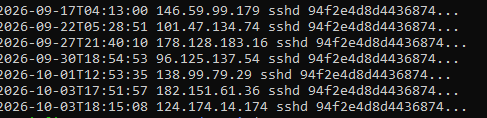

# SSH Propagation Payload Analysis

While reviewing files captured by my Cowrie honeypot, I found the same SSH-focused payload being uploaded repeatedly by different source IPs. The file was named `sshd` and appeared seven times between September 17 and October 3, 2026.

What made this sample stand out was what happened after the upload. The attackers attempted to execute the payload in the background, and later deployments passed lists of around 50 IP addresses to it. I decided to investigate the binary and compare the sessions to get a better idea of what it was being used for.

## Repeated Uploads

The payload had the following SHA-256 hash:

```text
94f2e4d8d4436874785cd14e6e6d403507b8750852f7f2040352069a75da4c00
```

Searching the Cowrie logs for this hash showed seven separate uploads from seven different source IP addresses.



| Date (UTC) | Source IP |
|---|---|
| 2026-09-17 | 146.59.99.179 |
| 2026-09-22 | 101.47.134.74 |
| 2026-09-27 | 178.128.183.16 |
| 2026-09-30 | 96.125.137.54 |
| 2026-10-01 | 138.99.79.29 |
| 2026-10-03 | 182.151.61.36 |
| 2026-10-03 | 124.174.14.174 |

Since all seven uploads produced the same SHA-256 hash, they were copies of the same file rather than unrelated files using the same name.

## Deployment Behavior

I went back through the Cowrie session logs for each upload to see what happened after the attackers logged in.

The general pattern was:

```text
Successful SSH login
        ↓
SFTP upload of "sshd"
        ↓
chmod +x
        ↓
nohup ./sshd <IP addresses> &
        ↓
disconnect
```

The payload was placed inside a randomly named directory each time. An example of the execution pattern was:

```bash
chmod +x ./<random-directory>/sshd; nohup ./<random-directory>/sshd <targets> &
```

Using `nohup` and `&` would allow the process to continue running in the background after the SSH session ended on a real compromised system.

Most of the successful sessions used the credentials:

```text
root / ubuntu
```

One of the later sessions used:

```text
root / debian
```

The first two deployments I found launched `sshd` without any IP addresses supplied to it.

Starting with the September 27 deployment, the attackers began passing large lists of IP addresses as command-line arguments. Most of these later commands contained around 50 addresses.

There was also noticeable overlap between the lists. Some addresses appeared in multiple deployments.

More interestingly, I found addresses that had previously uploaded the payload to my honeypot later appearing inside another deployment's target list. For example, `96.125.137.54` uploaded the payload on September 30 and later appeared in an October 3 list. `138.99.79.29` uploaded the payload on October 1 and also appeared in a later list.

This does not prove that every address in the lists was compromised or even successfully contacted. Cowrie captured the attempted execution command but did not actually run the malware. However, the repeated pattern suggests that these addresses were being supplied to the program for some type of automated SSH targeting or propagation activity.

## Static Analysis

I did not execute the captured binary.

All analysis was performed statically using tools such as `file`, `strings`, hashing utilities, and ELF metadata inspection.

The captured file was approximately 29 MB and identified as a stripped 64-bit Linux ELF executable.

Basic information:

| Property | Value |
|---|---|
| Filename | `sshd` |
| Type | ELF 64-bit Linux executable |
| Architecture | x86-64 |
| Size | ~29 MB |
| Stripped | Yes |
| SHA-256 | `94f2e4d8d4436874785cd14e6e6d403507b8750852f7f2040352069a75da4c00` |
| SHA-1 | `cbe89930c606fafad01189ce3dacc5228115bd4a` |
| MD5 | `0fa41de75420479c9120641df3b4f317` |

## SSH and Authentication Functionality

Looking through strings and metadata in the binary showed a large amount of SSH-related functionality.

Some of the libraries and functions included:

- PAM authentication
- SFTP support
- PTY support
- Go networking libraries
- Go cryptography libraries
- system and process information libraries

The binary referenced SSH host key locations such as:

```text
/etc/ssh/ssh_host_ed25519_key
/etc/ssh/ssh_host_ecdsa_key
/etc/ssh/ssh_host_rsa_key
```

PAM-related functions included references to authentication and session handling.

More interesting were application-specific Go structures found in the binary:

```text
main.credential
main._rig_config
main._update
attackqueue *[]main.credential
```

The `credential` and `attackqueue` references are especially notable when compared with the actual deployment behavior seen in Cowrie. Later copies of the binary were launched with long lists of IP addresses as arguments.

This combination is one of the reasons I believe the payload is related to automated SSH credential attacks or propagation.

## Network-Related Findings

The binary also contained several public IP lookup services, including references to services such as:

```text
api.ipify.org
ident.me
ipinfo.io/ip
checkip.amazonaws.com
ip.seeip.org
```

These could allow the program to determine the public IP address of the machine it is running on.

I also discovered a hardcoded Discord webhook inside the binary.

I did not contact or test the webhook. The webhook token is intentionally not included in this repository.

## Possible Persistence

Another interesting part of the binary was a group of systemd-related strings.

These included:

```text
/bin/systemd-worker
/lib/systemd/system/systemd-worker.service
[Service]
[Install]
WantedBy=multi-user.target
Environment="HOME=/"
LimitNOFILE=1006500
LimitNPROC=1006500
```

An `ExecStart` reference to `/bin/systemd-worker` was also found during analysis.

These strings suggest the binary may contain functionality for installing or running itself as a systemd service under the name `systemd-worker`.

That could provide persistence across reboots on a compromised Linux system.

However, these findings only show that the functionality or configuration data exists inside the binary. I did not observe the malware actually installing this service because the payload was never executed by Cowrie.

## Connecting the Binary to the Attack

The most useful part of the investigation was being able to connect the static analysis of the file with the actual attacker activity recorded by Cowrie.

Across multiple sessions, the attackers:

1. Successfully authenticated using weak root credentials.
2. Uploaded a file named `sshd` through SFTP.
3. Uploaded the exact same SHA-256 payload from multiple source IPs.
4. Made the uploaded file executable.
5. Attempted to launch it in the background using `nohup`.
6. Passed large lists of IP addresses to later deployments of the program.
7. Disconnected shortly after starting it.

The repeated behavior across different source IPs makes it unlikely that these were unrelated manual attacks.

Instead, the activity appears to be part of a repeatable automated deployment process.

## Why the Malware Did Not Infect the EC2 Host

Although the attacker issued commands such as:

```bash
chmod +x ./sshd
nohup ./sshd ... &
```

these commands were sent to the Cowrie honeypot rather than the actual Ubuntu shell running the EC2 instance.

Cowrie recorded the commands and captured the uploaded file, but the malicious binary was not executed on the underlying EC2 host.

This allowed me to preserve the payload and investigate the attack without intentionally running it.

## Assessment

Based on the Cowrie session logs and static analysis, I believe this sample is an SSH-focused malicious program with automated credential attack and/or propagation capabilities.

The strongest evidence for this assessment is the combination of:

- repeated deployment of the same binary
- weak SSH credentials used to gain access
- SFTP-based payload delivery
- automated background execution
- large lists of IP addresses passed to the binary
- credential-related structures inside the program
- an `attackqueue` structure
- SSH, PAM, SFTP, and PTY functionality
- possible systemd persistence functionality
- repeated deployment from different remote systems

I have not assigned the sample to a specific malware family. Some strings found during analysis could potentially be related to known malware, but I do not currently have enough evidence to make that attribution confidently.

## Indicators

### File Hashes

**SHA-256**

```text
94f2e4d8d4436874785cd14e6e6d403507b8750852f7f2040352069a75da4c00
```

**SHA-1**

```text
cbe89930c606fafad01189ce3dacc5228115bd4a
```

**MD5**

```text
0fa41de75420479c9120641df3b4f317
```

### Observed Filename

```text
sshd
```

### Observed Deployment Pattern

```text
SFTP upload
→ chmod +x
→ nohup ./sshd <target list> &
```

### Possible Persistence Artifacts

```text
/bin/systemd-worker
/lib/systemd/system/systemd-worker.service
```

## Takeaway

This ended up being one of the most useful findings from running the honeypot because it showed activity beyond basic SSH scanning and password guessing.

The same payload was delivered seven times over a period of more than two weeks. Cowrie captured both the binary and the commands used to deploy it, which made it possible to compare the attack behavior with information found inside the file.

The biggest thing I learned from this investigation was the value of collecting post-login activity. Looking only at successful and failed SSH logins would have shown that weak credentials were being tested, but it would have missed the payload deployment and the activity that followed a successful login.
