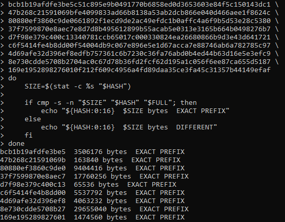

# SSH Propagation Payload Analysis

While monitoring my AWS Cowrie honeypot, I observed repeated SSH sessions that uploaded a file named `sshd`. What initially appeared to be several different payloads turned out to be repeated deployments and incomplete transfers of the same 30.3 MB Linux executable.

By correlating Cowrie session logs, SSH fingerprints, file hashes, attacker commands, and static analysis of the captured binary, I was able to reconstruct a larger pattern of automated SSH activity.

## Repeated Payload Deployment

The complete payload was captured with the following SHA-256 hash:

`94f2e4d8d4436874785cd14e6e6d403507b8750852f7f2040352069a75da4c00`

Cowrie recorded the complete payload being uploaded from seven different source IP addresses between September 17 and October 3, 2026.


The successful deployments followed a consistent pattern:

1. Authenticate to SSH using a weak root credential
2. Upload a file named `sshd` using SFTP
3. Make the file executable with `chmod +x`
4. Launch it in the background using `nohup`
5. Disconnect

Most successful sessions authenticated using:

`root / ubuntu`

The final observed deployment used:

`root / debian`

The first two deployments launched the binary without additional arguments. Beginning September 27, later sessions supplied roughly 50 IP addresses as command-line arguments:

```text
chmod +x ./<directory>/sshd;
nohup ./<directory>/sshd <IP1> <IP2> <IP3> ... &
```

Several IP addresses appeared repeatedly between these target lists. Two addresses that had previously uploaded the payload to my honeypot later appeared as arguments in another deployment.

This suggests the IP lists may have been used for automated targeting or propagation, although the command-line arguments alone do not prove that every listed system was successfully attacked.

## SSH Fingerprint Correlation

I compared the SSH clients responsible for the payload deployments.

All seven complete-payload sessions advertised:

`SSH-2.0-Go`

They also shared the same HASSH fingerprint:

`98ddc5604ef6a1006a2b49a58759fbe6`

Searching the complete Cowrie dataset revealed **27 sessions** using this fingerprint.

Several of those additional sessions also attempted to upload `sshd`, while others performed different activity. Because a HASSH fingerprint represents an SSH client's key-exchange configuration, it cannot identify an attacker by itself.

However, the combination of the same SSH fingerprint, Go client, filename, credentials, payload, and deployment commands provides much stronger evidence of related automated activity.

## Static Payload Analysis

I analyzed the captured binary without executing it.

The complete sample was:

- 30,304,472 bytes
- ELF 64-bit x86-64 executable
- Dynamically linked
- Stripped
- Built with substantial Go components

Static analysis revealed SSH and authentication-related functionality including:

- `github.com/pkg/sftp`
- `github.com/msteinert/pam`
- PTY support
- SSH host-key paths
- Go networking and cryptography packages

Application-specific strings included:

```text
main.credential
[]main.credential
attackqueue
sharepeer
shareupdateinfo
```

These strings suggest the program maintains credentials and an attack queue and contains functionality for communicating or sharing information between instances.

The binary also contains references to multiple services used to determine a system's public IP address, including ipify, ipinfo, ident.me, and AWS CheckIP.

A hardcoded Discord webhook was also present. The webhook token was intentionally omitted from this repository and was never contacted or tested.

## Persistence Indicators

Static strings also revealed what appears to be a systemd persistence mechanism:

```text
/bin/systemd-worker
/lib/systemd/system/systemd-worker.service
ExecStart=/bin/systemd-worker
WantedBy=multi-user.target
Environment="HOME=/"
```

The binary also contains unusually high process and file-descriptor limits associated with the service.

These strings strongly suggest the program contains functionality for installing itself as a service named `systemd-worker`.

Because this conclusion comes from static analysis, it does not prove that the persistence mechanism was executed during the observed honeypot sessions.

## Incomplete Payload Captures

Several other sessions using the same SSH fingerprint uploaded files named `sshd` with different SHA-256 hashes.

At first, these appeared to be separate payload variants.

Their sizes ranged from only **65,536 bytes** to nearly the complete **30.3 MB** binary. Several smaller samples still contained the same distinctive strings found in the complete payload.

I tested whether these files were actually incomplete copies of the full payload by comparing every captured byte against the complete sample.



Every smaller sample was an **exact byte-for-byte prefix** of the complete payload.

| Capture | Size | Result |
|---|---:|---|
| `bcb1b19...` | 3,506,176 B | Exact prefix |
| `47b268c...` | 163,840 B | Exact prefix |
| `80880ef...` | 9,404,416 B | Exact prefix |
| `37f7599...` | 17,760,256 B | Exact prefix |
| `d7f98e3...` | 65,536 B | Exact prefix |
| `c6f5414...` | 5,537,792 B | Exact prefix |
| `4d69afe...` | 4,063,232 B | Exact prefix |
| `8e730cd...` | 29,655,040 B | Exact prefix |
| `169e195...` | 1,474,560 B | Exact prefix |

This indicates that these were **truncated transfers of the same binary**, not separate malware variants.

It also explains why some partial files were still recognized as ELF executables while reporting missing section headers: the ELF header and beginning of the program had transferred successfully, but the upload ended before the complete file arrived.

This was also a useful reminder that hashes must be interpreted in context. Interrupted transfers of the same payload produce completely different SHA-256 hashes.

## Assessment

The evidence indicates that I captured a recurring automated SSH operation deploying the same Linux payload over approximately 17 days.

The strongest correlation points were:

- Identical complete payload SHA-256
- Repeated `sshd` filename
- Same `SSH-2.0-Go` client
- Same HASSH fingerprint
- Similar weak root credentials
- Consistent SFTP → chmod → nohup deployment
- Repeated IP lists supplied to later executions
- Multiple incomplete transfers confirmed as exact prefixes of the full payload

Static analysis indicates that the payload contains SSH, PAM authentication, SFTP, credential handling, attack-queue, networking, and possible persistence functionality.

Together, the evidence is consistent with an **SSH-focused malicious program capable of automated credential attacks and/or propagation**.

I have intentionally not assigned the sample to a specific malware family or threat actor because the evidence collected from the honeypot is not sufficient for confident attribution.

## Honeypot Safety

The payload was captured by Cowrie and was **never executed on the actual EC2 host**.

Commands entered by attackers were handled inside Cowrie's emulated environment, allowing the sessions and uploaded files to be studied without intentionally running the captured malware.

All analysis performed for this project was static.
