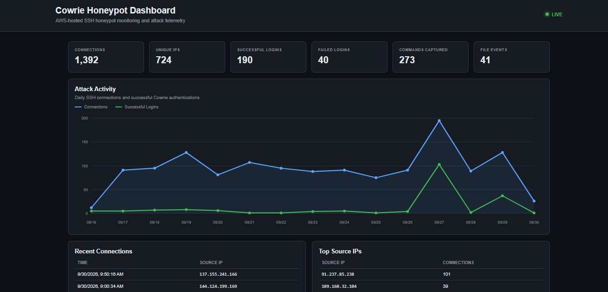

# Cowrie Honeypot Dashboard

A live web dashboard for monitoring sanitized telemetry collected by the AWS Cowrie SSH honeypot.

**Live Dashboard:** https://honeypot.eyoungcyber.com



## Features

The dashboard provides a live view of honeypot activity, including:

- Total SSH connections
- Unique source IPs
- Successful and failed authentication attempts
- Commands captured
- File transfer events
- Daily connection and authentication activity
- Recent connections
- Top source IPs
- Top usernames
- Top commands
- Recent commands
- HASSH fingerprint tracking

The site also includes a **Threat Analysis** section for viewing investigations of notable activity captured by the honeypot.

## How It Works

Cowrie generates JSON event logs containing information about SSH connections, authentication attempts, commands, fingerprints, and file transfers.

A Python script processes these logs and generates a sanitized `data.json` file for the dashboard.

```text
Cowrie Logs
     |
     v
Python Parser
     |
     v
Sanitized JSON
     |
     v
Nginx
     |
     v
Public Dashboard
```

A systemd timer regenerates the dashboard data every minute, while the frontend checks for updated data every 30 seconds.

## Threat Analysis

Notable activity is documented as individual investigation reports and published through the dashboard's Threat Analysis section.

These investigations include malware and SSH worm captures, credential activity, automated reconnaissance, SSH tunneling, and recurring attack patterns observed by the honeypot.

## Security

Only sanitized telemetry is provided to the public frontend.

The dashboard does not expose:

- Raw Cowrie logs
- Captured passwords
- Malware or transferred payloads
- SSH private keys
- Administrative SSH access
